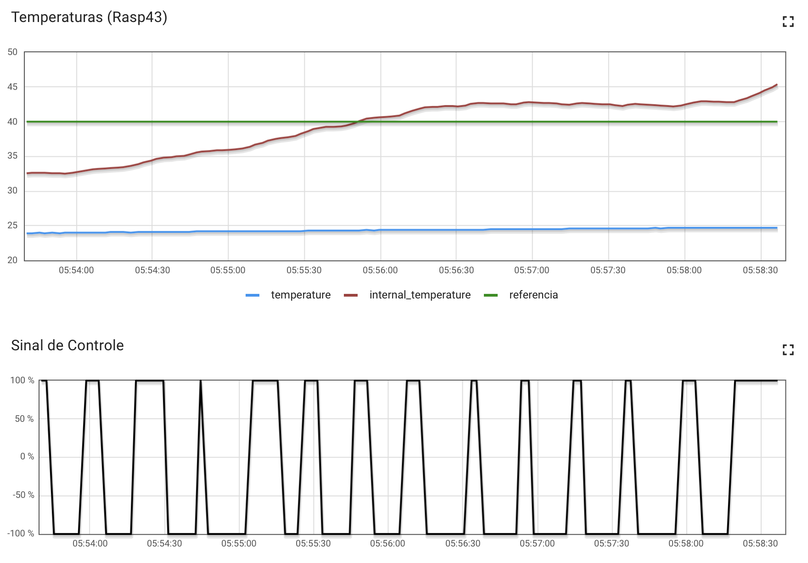

# Trabalho 2 - Fundamentos de Sistemas Embarcados

Nome: Dâmaso Júnio Pereira Brasileo
Matrícula: 17/0031438

## Como executar

Entrando na pasta raíz do projeto em: https://github.com/juniopereirab/FSE-Trabalho2

Execute os comandos:

```
cd Trabalho
make
bin/bin
```

Os comando `make` irá compilar o código e o `bin/bin` irá executá-lo.

## Gráficos de funcionamento



Foram executados por 4 minutos o funcionamento geral, onde a temperatura se manteve um pouco acima do esperado que seria a temperatura de referência. Porém o resultado final, se tornou satisfatório.